# ARCHITECTURE.md — data flow, tables, keys, sample-unit semantics

## 1. Data flow

```mermaid
flowchart LR
  subgraph ENUM["1 · Enumeration (deterministic, network)"]
    ENA[(ENA portal API)] -->|harvest_lib cache-through| SWEEP[resweep_universe.py<br/>frame-free sweep S1–S3b]
    ENA --> V3[enumerate_universe_v3.py<br/>taxon frames, superset check]
    SWEEP --> AGG[aggregate_studies.py<br/>study-level table + human-signal rule]
    V3 --> AGG
  end
  subgraph TRIAGE["2 · Triage (LLM, root-dispatched leaf workers)"]
    AGG --> DET[deterministic auto-exclude<br/>host taxon / isolate / amplicon]
    DET --> HS[Haiku screen 40/req]
    HS --> SR[Sonnet rubric ×2–3, 4/req<br/>run_sonnet_confirm.py]
    SR --> OA[Opus adjudication<br/>adjudicate.py]
    LIT[(Europe PMC / Crossref / S2)] --> PS[run_paper_screen.py<br/>Haiku 25/req] --> MINE[mine_accessions*.py<br/>link_papers.py] --> SR
    OA --> CS[(catalog_studies.parquet<br/>study_triage_v2.parquet)]
  end
  subgraph EXTRACT["3 · Per-sample extraction (LLM + deterministic)"]
    CS --> R1[R1 archive attrs<br/>r1_prime · r1_title_parser · r1_ext]
    CS --> R2[R2 supplementary tables<br/>r2_supp_extract_v2 · supp_parse · col_reader · r2_rescue_map]
    CS --> R3[R3 paper prose, group scope<br/>r3_prose_extract]
    CS --> R4[R4 abstract / ENA description<br/>r4_abstract_extract]
    R1 & R2 & R3 & R4 --> MERGE[merge_routes.py<br/>precedence R1>R2>R3>R4, Opus conflict patterns]
    MERGE --> SUBJ[subject_resolution.py] --> WIDE[build_wide.py · re_gate.py · build_fix.py]
  end
  subgraph RELEASE["4 · Package · site · publish (deterministic)"]
    WIDE --> FIND[apply_findings.py<br/>audit/findings/*.csv]
    FIND --> PKG[data package dir<br/>make_version.py → VERSION.json]
    PKG --> SITE[site_generator/gen/build_site.py]
    SITE --> VERIFY[Actions: verify.yml]
    VERIFY --> PAGES[deploy-pages.yml → olmlab.github.io/infant-gut-catalog]
    PKG --> REL[release.yml → Release assets + Zenodo DOI]
  end
  PAGES -->|Report an issue| ISSUE[GitHub Issue<br/>catalog-finding.yml] --> FIND
  KERNEL[[infant-curation-rules kernel.py<br/>= src/catalog/triage/curation_kernel.py]] -.validate every commit.-> TRIAGE & EXTRACT & FIND
```

Everything in 1 and 4 is deterministic and reproducible from `config/inputs.json` inputs; 2 and 3 call
`host.llm` and therefore run only inside a Claude Science root session (sub-agents cannot delegate), as leaf
workers that copy the stage scripts flat into their cwd, set the documented globals (`SLICE`, `OUT_PREFIX`,
`BATCH`, `MAX_TOKENS`, `MODEL`) and `exec` the script (`llm_batch_common.run_batches`: JSON-schema tool output,
`validate_row` on every row, checkpoint every 200 rows, missing ids → sentinel + re-run at batch 10).

## 2. Tables and keys (data package v1.1 → 1.2.0)

| table | key | rows (v11) | joins |
|---|---|---|---|
| `study_metadata_wide` | `study_accession` (PRJ…) | 389 | → `universe_studies_all` (all 9,579 screened), `cohorts.cohort_id`, `study_paper_links` |
| `universe_studies_all` | `study_accession` | 9,579 | triage verdict, `reason_code`, `decision_stage`, `confidence`, evidence |
| `sample_metadata_wide` | **`sample_key`** (BioSample accession, or run accession when `sample_unit='run'`) | 154,222 (16 are `biosample_pooled` parents — B2: exclude from counts) | `study_accession`; `parent_biosample`; `runs` via `runs.sample_accession` / `run_accession` |
| `sample_determinations` | (`sample_key`, `field_name`) — one current value per pair, plus `route`, `scope`, `evidence_*`, `confidence`, `determined_by`, `src_track` (+ `decision_stage` for auditor rows) | 609,584 | evidence trail for every wide-table value |
| `sample_determinations_superseded` | same + `superseded_by`, `superseded_reason` | 75 | history (B3: to be surfaced on the site) |
| `runs` | `run_accession` (SRR/ERR/DRR) | 174,022 | `sample_accession`, `study_accession`, library/instrument/base counts; Sandpiper key |
| `sample_subjects` | `sample_key` → `subject_id`, `t_index` | — | longitudinal structure |
| `cohorts` | `cohort_id` (COH…) | 373 | member studies, crosswalk names |
| `study_paper_links` | (`pmid`, `study_accession`) | 973 | `relation` ∈ own_data / reused_public_data / unsure |
| `sample_unit_classification` | `study_accession` | 11,116 rows | class A (run-keyed) / C (technical multi-run) evidence |
| `VERSION.json` (new) | — | — | release_tag, package_version, build_date, generator sha, per-table sha256 + rows |

Field vocabulary (16 fields): age_at_collection_days, gestational_age_weeks, preterm_status, delivery_mode,
feeding_mode, birth_weight_grams, antibiotic_exposure, maternal_antibiotics, probiotic_exposure,
hmo_supplementation, nec_status, country, geo_subregion, health_condition, multiple_birth, sibling_in_study
(+ sex, subject_id, timepoint_label as structural determinations). `confidence` is an ordinal engine tier
(R1 deterministic 0.90, title parser 0.70, R2 0.65–0.85, R3 0.25–0.80, R4 ≤ 0.5), not a calibrated probability (B8).

## 3. `sample_unit` semantics

* `biosample` (default): one catalog sample = one BioSample; its runs are technical replicates / lanes
  (`n_runs` ≥ 1). Determinations attach to the BioSample. Run-level external data (Sandpiper) is aggregated to
  the BioSample by **summing coverage across runs** (never averaging relative abundances — A16/B6).
* `run`: deposits with one BioSample per infant and one run per stool (6 studies, 521 rows; e.g. PRJNA294605).
  `sample_key` = run accession; `parent_biosample` = the shared BioSample; per-stool values (age, timepoint) live
  on the run row. Detected by the deterministic class-A criteria in `sample_unit_classification.csv`.
* `biosample_pooled`: the 16 parent BioSample rows of the run-keyed deposits, kept for provenance only —
  **excluded from every count, table and download** (B2; Integrate track fixes the generator).
* Identity columns to add in 1.2.0 (B15): always-populated `biosample_accession`, nullable `run_accession`, so the
  Sandpiper join is `COALESCE(run_accession, runs.run_accession)` without case logic.
* Discordant run profiles inside one BioSample (genus-level Bray–Curtis > 0.5) are a detector for undetected
  class-A deposits → `human_review_queue` with reason `sample_unit_discordant_profiles` (B6).

## 4. Where each artifact-store input enters
`config/inputs.json` lists them with artifact id, version id and sha256: data_package_v1.zip (package tables),
catalog_studies.parquet + study_triage_v2.parquet (triage state consumed by resweep/triage), site_generator.zip,
release_bundle.tar.gz (reports + evidence trails), harvest_cache.tar.gz (working_data; resume substrate),
infant_catalog.sqlite, auditor_findings.csv, site.zip. `bootstrap.py` materialises them into `data/inputs/`.
