# ARCHITECTURE.md — data flow, tables, keys, sample-unit semantics

## 1. Data flow

```mermaid
flowchart LR
  subgraph ENUM["1 · Enumeration (deterministic, network)"]
    ENA[(ENA portal API)] -->|harvest_lib cache-through| SWEEP[resweep_universe.py<br/>frame-free sweep S1–S3b]
    ENA --> V3[enumerate_universe_v3.py<br/>taxon frames, superset check]
    SWEEP --> AGG[aggregate_studies.py<br/>study-level table + human-signal rule]
    V3 --> AGG
  end
  subgraph TRIAGE["2 · Triage (LLM, root-dispatched leaf workers)"]
    AGG --> DET[deterministic auto-exclude<br/>host taxon / isolate / amplicon]
    DET --> HS[Haiku screen 40/req]
    HS --> SR[Sonnet rubric ×2–3, 4/req<br/>run_sonnet_confirm.py]
    SR --> OA[Opus adjudication<br/>adjudicate.py]
    LIT[(Europe PMC / Crossref / S2)] --> PS[run_paper_screen.py<br/>Haiku 25/req] --> MINE[mine_accessions*.py<br/>link_papers.py] --> SR
    OA --> CS[(catalog_studies.parquet<br/>study_triage_v2.parquet)]
  end
  subgraph EXTRACT["3 · Per-sample extraction (LLM + deterministic)"]
    CS --> R1[R1 archive attrs<br/>r1_prime · r1_title_parser · r1_ext]
    CS --> R2[R2 supplementary tables<br/>r2_supp_extract_v2 · supp_parse · col_reader · r2_rescue_map]
    CS --> R3[R3 paper prose, group scope<br/>r3_prose_extract]
    CS --> R4[R4 abstract / ENA description<br/>r4_abstract_extract]
    R1 & R2 & R3 & R4 --> MERGE[merge_routes.py<br/>precedence R1>R2>R3>R4, Opus conflict patterns]
    MERGE --> SUBJ[subject_resolution.py] --> WIDE[build_wide.py · re_gate.py · build_fix.py]
  end
  subgraph RELEASE["4 · Package · site · publish (deterministic)"]
    WIDE --> FIND[apply_findings.py<br/>audit/findings/*.csv]
    FIND --> PKG[data package dir<br/>make_version.py → VERSION.json]
    PKG --> SITE[site_generator/gen/build_site.py]
    SITE --> VERIFY[Actions: verify.yml]
    VERIFY --> PAGES[deploy-pages.yml → olmlab.github.io/infant-gut-catalog]
    PKG --> REL[release.yml → Release assets + Zenodo DOI]
  end
  PAGES -->|Report an issue| ISSUE[GitHub Issue<br/>catalog-finding.yml] --> FIND
  KERNEL[[infant-curation-rules kernel.py<br/>= src/catalog/triage/curation_kernel.py]] -.validate every commit.-> TRIAGE & EXTRACT & FIND
```

Everything in 1 and 4 is deterministic and reproducible from `config/inputs.json` inputs; 2 and 3 call
`host.llm` and therefore run only inside a Claude Science root session (sub-agents cannot delegate), as leaf
workers that copy the stage scripts flat into their cwd, set the documented globals (`SLICE`, `OUT_PREFIX`,
`BATCH`, `MAX_TOKENS`, `MODEL`) and `exec` the script (`llm_batch_common.run_batches`: JSON-schema tool output,
`validate_row` on every row, checkpoint every 200 rows, missing ids → sentinel + re-run at batch 10).

## 2. Tables and keys (data package v1.1 → 1.2.0)

| table | key | rows (v11) | joins |
|---|---|---|---|
| `study_metadata_wide` | `study_accession` (PRJ…) | 389 | → `universe_studies_all` (all 9,579 screened), `cohorts.cohort_id`, `study_paper_links` |
| `universe_studies_all` | `study_accession` | 9,579 | triage verdict, `reason_code`, `decision_stage`, `confidence`, evidence |
| `sample_metadata_wide` | **`sample_key`** (BioSample accession, or run accession when `sample_unit='run'`) | 154,222 (16 are `biosample_pooled` parents — B2: exclude from counts) | `study_accession`; `parent_biosample`; `runs` via `runs.sample_accession` / `run_accession` |
| `sample_determinations` | (`sample_key`, `field_name`) — one current value per pair, plus `route`, `scope`, `evidence_*`, `confidence`, `determined_by`, `src_track` (+ `decision_stage` for auditor rows) | 609,584 | evidence trail for every wide-table value |
| `sample_determinations_superseded` | same + `superseded_by`, `superseded_reason` | 75 | history (B3: to be surfaced on the site) |
| `runs` | `run_accession` (SRR/ERR/DRR) | 174,022 | `sample_accession`, `study_accession`, library/instrument/base counts; Sandpiper key |
| `sample_subjects` | `sample_key` → `subject_id`, `t_index` | — | longitudinal structure |
| `cohorts` | `cohort_id` (COH…) | 373 | member studies, crosswalk names |
| `study_paper_links` | (`pmid`, `study_accession`) | 973 | `relation` ∈ own_data / reused_public_data / unsure |
| `sample_unit_classification` | `study_accession` | 11,116 rows | class A (run-keyed) / C (technical multi-run) evidence |
| `VERSION.json` (new) | — | — | release_tag, package_version, build_date, generator sha, per-table sha256 + rows |

Field vocabulary (16 fields): age_at_collection_days, gestational_age_weeks, preterm_status, delivery_mode,
feeding_mode, birth_weight_grams, antibiotic_exposure, maternal_antibiotics, probiotic_exposure,
hmo_supplementation, nec_status, country, geo_subregion, health_condition, multiple_birth, sibling_in_study
(+ sex, subject_id, timepoint_label as structural determinations). `confidence` is an ordinal engine tier
(R1 deterministic 0.90, title parser 0.70, R2 0.65–0.85, R3 0.25–0.80, R4 ≤ 0.5), not a calibrated probability (B8).

## 3. `sample_unit` semantics

* `biosample` (default): one catalog sample = one BioSample; its runs are technical replicates / lanes
  (`n_runs` ≥ 1). Determinations attach to the BioSample. Run-level external data (Sandpiper) is aggregated to
  the BioSample by **summing coverage across runs** (never averaging relative abundances — A16/B6).
* `run`: deposits with one BioSample per infant and one run per stool (6 studies, 521 rows; e.g. PRJNA294605).
  `sample_key` = run accession; `parent_biosample` = the shared BioSample; per-stool values (age, timepoint) live
  on the run row. Detected by the deterministic class-A criteria in `sample_unit_classification.csv`.
* `biosample_pooled`: the 16 parent BioSample rows of the run-keyed deposits, kept for provenance only —
  **excluded from every count, table and download** (B2; Integrate track fixes the generator).
* Identity columns to add in 1.2.0 (B15): always-populated `biosample_accession`, nullable `run_accession`, so the
  Sandpiper join is `COALESCE(run_accession, runs.run_accession)` without case logic.
* Discordant run profiles inside one BioSample (genus-level Bray–Curtis > 0.5) are a detector for undetected
  class-A deposits → `human_review_queue` with reason `sample_unit_discordant_profiles` (B6).

## 4. Where each artifact-store input enters
`config/inputs.json` lists them with artifact id, version id and sha256: data_package_v1.zip (package tables),
catalog_studies.parquet + study_triage_v2.parquet (triage state consumed by resweep/triage), site_generator.zip,
release_bundle.tar.gz (reports + evidence trails), harvest_cache.tar.gz (working_data; resume substrate),
infant_catalog.sqlite, auditor_findings.csv, site.zip. `bootstrap.py` materialises them into `data/inputs/`.

## 5. Release history views (R2026.1, Site track — MATURITY_PLAN §2)
`config/releases.yaml` is the ONE spec both tracks read (release ids, the three bitemporal columns
`release_added` / `release_retired` / `package_added`, the fact-table list, `sample_determinations_all.parquet`,
`releases.csv`, `RELEASE_NOTES_<id>.md`, and the site page paths). `build_site.py --releases-config` loads it and
asserts: `VERSION.json.release_id` is the newest `releases.csv` row, its `package_version`/`data_tag` agree with
VERSION.json, every release id used by `sample_determinations` / `universe_studies_all` / `sample_determinations_all`
exists in the registry, and the `_all` table's current rows equal `sample_determinations`.

| page | source | content |
|---|---|---|
| `releases/index.html` | `releases.csv`, `RELEASE_NOTES_<id>.md` | registry (id, date, package, data/site tags → GitHub Release URLs, DOI or "pending", counts, Sandpiper version, link to changes) + every notes file rendered with `markdown`; Cite box |
| Cite box (`_cite.html`, on home + releases) | VERSION.json, releases.csv, `config/site.yaml github.data_repo_id` | `Infant Gut Shotgun-Metagenome Catalog, release <id> (data package <semver>), OlmLab, <date>`; Zenodo badge `https://zenodo.org/badge/<repo_id>.svg` → `https://zenodo.org/badge/latestdoi/<repo_id>`; "DOI: pending Zenodo integration" while `doi` is empty; the three upstream citations (ENA/INSDC, Woodcroft et al. 2025 + Zenodo 20419175, curatedMetagenomicData) |
| `changes/index.html`, `changes/<id>.html` | `universe_studies_all` (`release_added == id`), `sample_determinations_all` (`release_added == id` / `release_retired == id`), `study_verdict_history` (previous verdict) | per release: verdict rows added (with previous differing verdict where the history has one), determinations added/retired per field, top-20 studies by rows changed (study-page + explorer deep links), retiring stages; one-line "nothing changed" state; each page asserted < 2 MB (aggregates only, never per-sample rows) |
| study pages `#timeline` | `universe_studies_all` all rows of the study (current + retired) | "Verdict timeline across releases" (release added/retired, verdict, confidence, stage, reason, quote) above the within-release "Decision history" |
| explorer detail panel | `data/sample_determinations_all.parquet` (on demand, `ensureSda`) | "Value timeline across releases": per field, current row first then retired rows (value, route/scope/tier, release added, release retired, retired reason · change stage, evidence quote); README-rule-hidden rows marked |
| footer (every page) | VERSION.json, releases.csv | `release <id> · package <semver> · build <sha> · built <date> · data tag <tag> · DOI …` + `<meta name="catalog-release-id">` |

Tests: `site_generator/gen/tests/test_release_pages.py` (spec layer always; built-site layer with
`CATALOG_SITE_DIR` + `CATALOG_PACKAGE_DIR`, including a DuckDB replay of the explorer's timeline SQL).
`site_generator/gen/tests/make_mock_release_package.py` builds a placeholder 1.3.0 package from an unpacked 1.2.2
package for generator development; the Data track's `src/catalog/release/` produces the real one.

## 6. Contribution worklist and intake (R2026.2 / package 1.4.0 — MATURITY_PLAN §3.2–3.4)

**Spec.** `config/contribute.yaml` is the ONE schema both tracks read: blocker codes (+ labels), contribution types (+ labels), the six
core fields with priority weights, `missing_threshold`, the column lists of `contribute_worklist.csv` / `contribute_worklist_fields.csv`,
the Issue-form ids and the `issue_url` template. The Data track's `build_worklist` writes the two tables into the package; the Site track's
generator only reads them (never recomputes a blocker or a tier).

**Tables.** `contribute_worklist.csv`: one row per OPEN study (verdict include|uncertain, ≥ 1 core field with catalog-scope coverage
< 0.5), ranked by `priority_score = Σ_missing weight × (1 − coverage) × log10(n_catalog_scope + 1)`; carries coverage_* and best_tier_*
per field, ONE `blocker_code`, `blocker_detail`/`unlock_text` (≤ 200 chars), `contribution_type` (primary ask), paper counts/PMIDs,
ENA/NCBI links, the prefilled `issue_url` and the bitemporal columns. `contribute_worklist_fields.csv`: study × field with coverage,
`n_with_value`, tier, field-level blocker and evidence. Studies with nothing missing are absent (blocker `complete` is never written).

**Site.** `contribute/index.html` (nav "Contribute"; home stat card): intro (5 types, licence, what happens next, claim-a-task), summary
cards (open studies, samples affected, studies per blocker), the ranked table rendered server-side with `data-*` attributes and filtered
client-side (blocker, missing field, contribution type, minimum samples, verdict, text search; URL query keys `blocker/field/type/min/
verdict/q` preselect). No per-sample rows; `data/contribute_worklist.json` is the same content as compact JSON. Study pages of worklist
studies carry the `#help-complete` panel (chips per field = coverage % + tier, blocker label + detail, unlock text, Contribute button);
complete studies have no panel. Build assertions: worklist columns == spec, vocabularies, rank 1..n, one Contribute button per row,
`n_catalog_scope` equals `study_metadata_wide` (F13), field-gap counts agree between the two tables, page < 2 MB, no placeholder URL.
A package of release ≥ R2026.2 MUST contain the worklist; older packages build without the page (backward compatible).

**Intake (zero backend).** The Contribute button opens `.github/ISSUE_TEMPLATE/catalog-contribution.yml` in the site repo prefilled via
query keys (`study_accession`, `contribution_type`, `release_tag`, `title`). `make ingest-contributions`
(`src/catalog/contribute/ingest_contributions.py`) lists Issues labelled `contribution`, parses the form body, downloads attachments
(`github.com/user-attachments/{files,assets}/…`, `user-images.githubusercontent.com`) into `audit/contributions/<issue>/` with
`manifest.json` (sha256, size, uploader login + hash, declared study/type/source/licence, note with e-mails stripped), rejects > 50 MB
and non-table extensions, reads CSV/TSV/TXT/XLSX (all sheets) and runs the deterministic joinability check: every identifier-like column is
matched exactly against the declared study's run accessions (`runs.parquet`), `sample_key` / `secondary_sample` / `sample_title` /
`biosample_accession` (`sample_metadata_wide`) and `library_name`. Verdicts: `accepted_for_review` (≥ max(20, 50 % of rows) match one
key type), `duplicate_of_existing` (sha256 seen), `unjoinable` (top-3 candidate columns + observed ID form reported), `rejected`
(type/size/no table/no attachment). `--comment` posts REPORT.md to the Issue. Curation of accepted tables is the normal R2 extraction
contract (RUNBOOK §4b); nothing enters the package without it.

## 7. Registry tier inside the catalog (scale-up S1 / R2026.4 — SCALE_UP_PLAN §2; owner-authorised deviation from §3)

**Decision.** The registry tier ("all human shotgun metagenomes", all body sites and ages) lives INSIDE the existing repos rather than in
separate `human-metagenome-registry*` repos: new `registry_*` tables in the data package and a `registry/` section on the site. The infant
gut catalog becomes the first *curated* scope (routes R2–R4, study pages); registry rows are archive-only classifications (route R1).

**Spec.** `config/scope.yaml` (scopes with deterministic membership rules, `registry_columns` order, value lists, files) and
`config/vocab/*.yaml` (body sites with UBERON anchors + whole-word match terms + negatives; life stages with day bounds; assay rules from
ENA fields; population flags). Written first by the S1 track from the frozen spec; the S0 (registry data) copies win at merge.

**Tables.** `registry_studies.parquet` — one row per ENA study in the registry universe (host, sites, stages, assay, access, evidence JSON
lists of `{source, quote ≤ 12 words}`, classification_stage ∈ deterministic_prior | deterministic_rule | sonnet_x2 | opus_adjudicated |
pending, confidence, `in_infant_catalog` = the infant verdict, `infant_reason_code`, `scope_memberships`, `universe_slice`, bitemporal
columns). `registry_runs.parquet` — every run with the 46 ENA read_run PULL_FIELDS + found_by + study_accession (Release asset, never a site
file). `registry_universe_audit.csv` — per-slice ENA count vs rows pulled.

**Site.** `registry/index.html` (landing + facets + DuckDB-WASM explorer over `data/registry_studies.parquet`, CSV export, row detail with
evidence and infant verdict), `registry/scopes/<scope_id>.html` (one per scope), home card, nav link, Methods › Registry classification.
Registry-only studies have no page (36k+ pages would exceed the Pages budget); included infant studies link to their study page.
Invariants: `in_infant_catalog = include` == `study_metadata_wide` studies; `in_infant_catalog` == `universe_studies_all.triage_verdict`;
all codes within the vocabularies; facet sums == row counts; F7/F13, 2 MB/page, 0 broken links, deterministic build.
